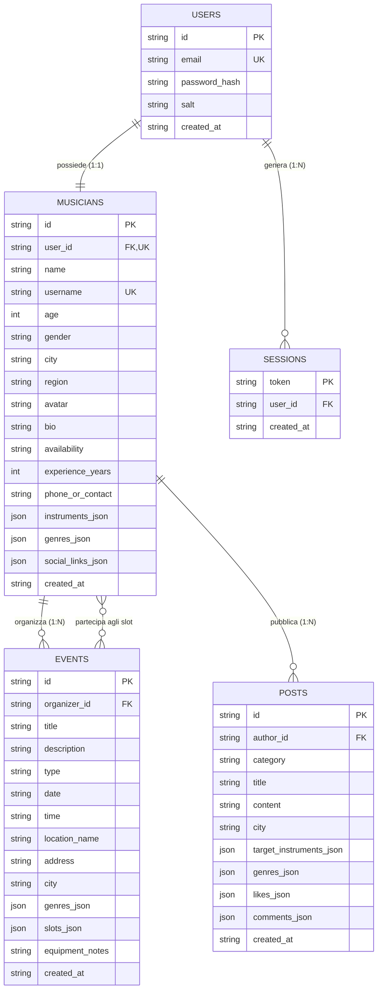

# 🗄️ Modelli Dati e Attributi di BandMate

Questo documento descrive in dettaglio l'architettura dei dati di **BandMate**, le collezioni memorizzate nel database **MongoDB Atlas** (cloud-hosted), i relativi schemi Mongoose (`server/models/`), i tipi TypeScript corrispondenti (`src/types/index.ts`), le relazioni tra le entità e tutti gli attributi con relativi vincoli e descrizioni.


---

## 📐 Schema Relazionale (Entity-Relationship)



---

## 1. Modello `User` (Tabella `users`)

Rappresenta le credenziali di autenticazione e l'account di accesso al sistema.

### Attributi della Tabella SQL

| Attributo | Tipo SQL | Vincoli | Tipo TS | Descrizione |
|---|---|---|---|---|
| `id` | `TEXT` | `PRIMARY KEY` | `string` | Identificativo univoco dell'utente (es. `'u_1789035450680'`). |
| `email` | `TEXT` | `UNIQUE`, `NOT NULL` | `string` | Indirizzo email normalizzato in minuscolo. |
| `password_hash` | `TEXT` | `NOT NULL` | `string` | Hash crittografico calcolato tramite `crypto.scryptSync`. |
| `salt` | `TEXT` | `NOT NULL` | `string` | Salt casuale a 16 byte (`randomBytes`) generato per utente. |
| `created_at` | `TEXT` | `NOT NULL` | `string` | Timestamp ISO 8601 di registrazione (es. `'2026-09-10T10:11:34.000Z'`). |

---

## 2. Modello `Session` (Tabella `sessions`)

Rappresenta le sessioni di autenticazione attive e i Bearer Token validi per effettuare chiamate protette alle API.

### Attributi della Tabella SQL

| Attributo | Tipo SQL | Vincoli | Tipo TS | Descrizione |
|---|---|---|---|---|
| `token` | `TEXT` | `PRIMARY KEY` | `string` | Token crittografico sicuro a 64 caratteri esadecimali (`randomBytes(32)`). |
| `user_id` | `TEXT` | `NOT NULL`, `REFERENCES users(id) ON DELETE CASCADE` | `string` | Chiave esterna che punta all'utente proprietario della sessione. |
| `created_at` | `TEXT` | `NOT NULL` | `string` | Data e ora di emissione del token in formato ISO 8601. |

---

## 3. Modello `MusicianProfile` (Tabella `musicians`)

Rappresenta l'identità artistica e la scheda pubblica del musicista all'interno della rete sociale.

### Attributi della Tabella SQL

| Attributo | Tipo SQL | Vincoli | Tipo TS | Descrizione |
|---|---|---|---|---|
| `id` | `TEXT` | `PRIMARY KEY` | `string` | Identificativo univoco del musicista (es. `'m1'`). |
| `user_id` | `TEXT` | `UNIQUE`, `NOT NULL`, `REFERENCES users(id) ON DELETE CASCADE` | `string` | Riferimento 1-a-1 con l'account di login nella tabella `users`. |
| `name` | `TEXT` | `NOT NULL` | `string` | Nome e cognome o nome d'arte (es. `'Davide De Luca'`). |
| `username` | `TEXT` | `UNIQUE`, `NOT NULL` | `string` | Slug univoco per menzioni (es. `'davidedeluca'`). |
| `age` | `INTEGER` | `NOT NULL` | `number` | Età anagrafica del musicista (es. `26`). |
| `gender` | `TEXT` | `NOT NULL` | `Gender` | Sesso (`'Uomo'`, `'Donna'`, `'Non binario'`, `'Preferisco non specificare'`). |
| `city` | `TEXT` | `NOT NULL` | `string` | Città e provincia di provenienza (es. `'Milano (MI)'`). |
| `region` | `TEXT` | - | `string` | Regione di appartenenza (es. `'Lombardia'`). |
| `avatar` | `TEXT` | - | `string` | URL dell'immagine del profilo o preset avatar. |
| `bio` | `TEXT` | - | `string` | Biografia descrittiva, influenze, ambizioni ed esperienze. |
| `availability` | `TEXT` | `NOT NULL` | `AvailabilityStatus` | Disponibilità (`'Disponibile per Jam'`, `'Cerco Band fissa'`, ecc.). |
| `experience_years`| `INTEGER` | `NOT NULL` | `number` | Anni totali di esperienza musicale (es. `10`). |
| `phone_or_contact`| `TEXT` | - | `string` | Email o contatto Instagram pubblico per accordi diretti senza DM privati. |
| `instruments_json`| `TEXT` | `NOT NULL` | `InstrumentItem[]` | Array JSON degli strumenti suonati con relativo livello e flag principale. |
| `genres_json` | `TEXT` | `NOT NULL` | `string[]` | Array JSON dei generi musicali preferiti. |
| `social_links_json`| `TEXT` | - | `SocialLinks` | Oggetto JSON con profili esterni (Instagram, Spotify, YouTube). |
| `created_at` | `TEXT` | `NOT NULL` | `string` | Timestamp ISO 8601 di creazione del profilo. |

---

### Sotto-Strutture di `MusicianProfile`

#### `InstrumentItem`
```typescript
interface InstrumentItem {
  name: string;        // Es. "Chitarra Elettrica", "Basso Elettrico", "Batteria", "Voce"
  level: SkillLevel;   // "Principiante" | "Intermedio" | "Avanzato" | "Professionista"
  isPrimary?: boolean; // true se è lo strumento principale del musicista
}
```

#### `SocialLinks`
```typescript
interface SocialLinks {
  instagram?: string;  // Handle o link Instagram
  spotify?: string;    // Nome artista o link profilo Spotify
  youtube?: string;    // Canale YouTube
  soundcloud?: string; // Profilo Soundcloud
}
```

---

## 4. Modello `JamEvent` (Tabella `events`)

Rappresenta una sessione di prova, una jam session aperta o un evento dal vivo organizzato da un musicista, caratterizzato da slot strumentali prenotabili.

### Attributi della Tabella SQL

| Attributo | Tipo SQL | Vincoli | Tipo TS | Descrizione |
|---|---|---|---|---|
| `id` | `TEXT` | `PRIMARY KEY` | `string` | Identificativo univoco dell'evento (es. `'e1'`). |
| `organizer_id` | `TEXT` | `NOT NULL`, `REFERENCES musicians(id) ON DELETE CASCADE` | `string` | ID del musicista che ha creato e coordina la jam. |
| `title` | `TEXT` | `NOT NULL` | `string` | Titolo descrittivo dell'incontro (es. `'Funk & Soul Open Jam'`). |
| `description` | `TEXT` | - | `string` | Descrizione dettagliata del programma e brani previsti. |
| `type` | `TEXT` | `NOT NULL` | `EventType` | Categoria (`'Jam Session'`, `'Prove di Gruppo'`, `'Live / Concerto'`, ecc.). |
| `date` | `TEXT` | `NOT NULL` | `string` | Data dell'evento formato `'YYYY-MM-DD'` (es. `'2026-09-22'`). |
| `time` | `TEXT` | `NOT NULL` | `string` | Orario di inizio formato `'HH:MM'` (es. `'21:00'`). |
| `location_name`| `TEXT` | `NOT NULL` | `string` | Nome della sala prove, locale o parco (es. `'SoundLab Studio'`). |
| `address` | `TEXT` | - | `string` | Indirizzo stradale della sede (es. `'Via Tortona 32'`). |
| `city` | `TEXT` | `NOT NULL` | `string` | Città di svolgimento (es. `'Milano (MI)'`). |
| `genres_json` | `TEXT` | `NOT NULL` | `string[]` | Array JSON dei generi suonati nell'evento. |
| `slots_json` | `TEXT` | `NOT NULL` | `InstrumentSlot[]` | Array JSON con gli slot degli strumenti e i musicisti iscritti. |
| `equipment_notes`| `TEXT` | - | `string` | Note sulla strumentazione disponibile in sala (ampli, batteria, microfoni). |
| `created_at` | `TEXT` | `NOT NULL` | `string` | Timestamp ISO 8601 di pubblicazione dell'evento. |

---

### Sotto-Strutture di `JamEvent`

#### `InstrumentSlot`
Definisce quanti posti sono a disposizione per un certo strumento e chi li occupa attualmente:
```typescript
interface InstrumentSlot {
  id: string;              // Es. "slot_1789035450_0"
  instrument: string;      // Es. "Batteria", "Basso Elettrico", "Chitarra Elettrica"
  maxCount: number;        // Numero massimo di musicisti ammessi per questo strumento (es. 1, 2)
  assignedMusicians: {
    musicianId: string;    // Riferimento a musicians.id
    musicianName: string;  // Nome denormalizzato per rendering veloce
    musicianAvatar: string;// Avatar denormalizzato
    joinedAt: string;      // Data di iscrizione ("YYYY-MM-DD")
  }[];
}
```

---

## 5. Modello `Post` (Tabella `posts`)

Rappresenta un annuncio pubblicato sulla bacheca sociale della community, visibile pubblicamente e aperto a commenti/risposte e like/applausi.

### Attributi della Tabella SQL

| Attributo | Tipo SQL | Vincoli | Tipo TS | Descrizione |
|---|---|---|---|---|
| `id` | `TEXT` | `PRIMARY KEY` | `string` | Identificativo univoco dell'annuncio (es. `'p1'`). |
| `author_id` | `TEXT` | `NOT NULL`, `REFERENCES musicians(id) ON DELETE CASCADE` | `string` | ID del musicista che ha pubblicato l'annuncio. |
| `category` | `TEXT` | `NOT NULL` | `PostCategory` | Tipologia (`'cercasi-musicista'`, `'cercasi-band'`, `'proposta-jam'`, `'generale'`). |
| `title` | `TEXT` | `NOT NULL` | `string` | Titolo sintetico dell'annuncio. |
| `content` | `TEXT` | `NOT NULL` | `string` | Testo completo del post (supporta a capo). |
| `city` | `TEXT` | `NOT NULL` | `string` | Città di riferimento territoriale per l'annuncio. |
| `target_instruments_json`| `TEXT` | `NOT NULL` | `string[]` | Array JSON degli strumenti ricercati o interessati. |
| `genres_json` | `TEXT` | `NOT NULL` | `string[]` | Array JSON dei generi musicali del progetto. |
| `likes_json` | `TEXT` | `NOT NULL` | `string[]` | Array JSON con gli ID dei musicisti che hanno applaudito (`musicianId[]`). |
| `comments_json`| `TEXT` | `NOT NULL` | `PostComment[]`| Array JSON con le risposte pubbliche lasciate sotto al post. |
| `created_at` | `TEXT` | `NOT NULL` | `string` | Timestamp ISO 8601 di pubblicazione. |

---

### Sotto-Struttura `PostComment`
Rappresenta una risposta pubblica di un altro musicista:
```typescript
interface PostComment {
  id: string;               // Identificativo univoco del commento (es. "c_1789035450_0")
  authorId: string;         // Riferimento a musicians.id
  authorName: string;       // Nome dell'autore
  authorAvatar: string;     // Foto profilo
  authorInstrument: string; // Strumento principale dell'autore (es. "Chitarra Elettrica")
  content: string;          // Testo della risposta
  createdAt: string;        // Timestamp ISO 8601
}
```

---

## 6. Tipi Enumerativi e Costanti di Dominio

```typescript
// Sesso
export type Gender = 
  | 'Uomo' 
  | 'Donna' 
  | 'Non binario' 
  | 'Preferisco non specificare';

// Livello di abilità sullo strumento
export type SkillLevel = 
  | 'Principiante' 
  | 'Intermedio' 
  | 'Avanzato' 
  | 'Professionista';

// Stato di disponibilità del musicista
export type AvailabilityStatus = 
  | 'Disponibile per Jam'
  | 'Cerco Band fissa'
  | 'Disponibile per serate/live'
  | 'Solo per divertimento'
  | 'Progetti studio/registrazione';

// Tipologia di incontro / evento
export type EventType = 
  | 'Jam Session' 
  | 'Prove di Gruppo' 
  | 'Live / Concerto' 
  | 'Aperitivo Musicale' 
  | 'Workshop';

// Categoria dell'annuncio in bacheca
export type PostCategory = 
  | 'cercasi-musicista' 
  | 'cercasi-band' 
  | 'proposta-jam' 
  | 'generale';
```

---

## 7. Integrità Referenziale e Regole di Business

1. **Eliminazione a cascata (`ON DELETE CASCADE`)**:
   - Se un utente viene rimosso dalla tabella `users`, vengono automaticamente cancellate le sue sessioni (`sessions`) e il suo profilo musicista (`musicians`).
   - Se un profilo musicista viene rimosso, vengono automaticamente eliminati gli eventi da lui organizzati (`events`) e i suoi post in bacheca (`posts`).
2. **Univocità e Normalizzazione**:
   - Le email sono vincolate ad essere univoche (`UNIQUE`) e vengono sempre salvate in caratteri minuscoli.
   - Gli username (`username`) sono univoci e generati in modo URL-safe.
3. **Serializzazione JSON in SQLite**:
   - I campi strutturati nidificati (`instruments_json`, `genres_json`, `slots_json`, `likes_json`, `comments_json`) sono serializzati come stringhe JSON valide con helper dedicati (`formatMusicianRow`, `formatEventRow`, `formatPostRow`) garantendo massima flessibilità senza dover ricorrere a decine di tabelle ponte relazionali per liste semplici.
